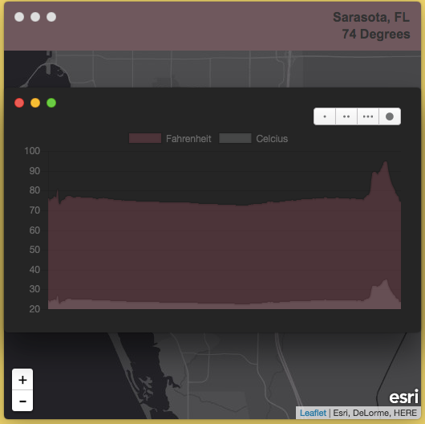

# zissou




> Graphical real-time display for an Arduino based data-logger

TODO: Fill out this long description.

## Table of Contents

- [Install](#install)
- [Usage](#usage)
- [Contribute](#contribute)
- [License](#license)

## Install

```
cd zissou
npm install
```

## Usage

```
npm start
```

## Contribute

PRs accepted.

## License

MIT © Ben Carothers
